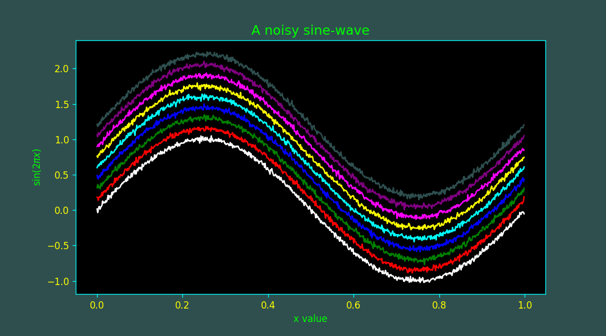

# XGTerm Plot Style in Matplotlib

This notebook provides an example of how to style your Maptplotlib plots with the same color scheme as XGterm.

## XGTerm stylesheet

Matplotlib can be customized by redefining certain 'rcParams', either by explicitly putting the style file in a known location or via a URL.  The parameters in question are:

        axes.facecolor: black
        axes.edgecolor: cyan
        axes.labelcolor: lime
        axes.titlecolor: lime
        axes.prop_cycle: cycler('color', ['white','red','green','blue','cyan','yellow','magenta','purple','darkslategray'])
        figure.edgecolor:darkslategrey
        figure.facecolor:darkslategrey
        xtick.color: cyan
        xtick.labelcolor: yellow
        ytick.color: cyan
        ytick.labelcolor: yellow
        legend.facecolor: black

To use this stylesheet, copy the above to a file called `xgterm.mplstyle` in your `$HOME/.config/matplotlib/stylelib directory` (which you may have to create).  You would then use the command:

    `plt.style.use("xgterm")`
    
in your code the apply the global style. The stylesheet may also be specified
as a URL requiring no installation, for example

     `plt.style.use('https://tinyurl.com/xgtermstyle')`

For more information see the [Matplotlib Tutorial](https://matplotlib.org/stable/tutorials/introductory/customizing.html).

## Example Plot

